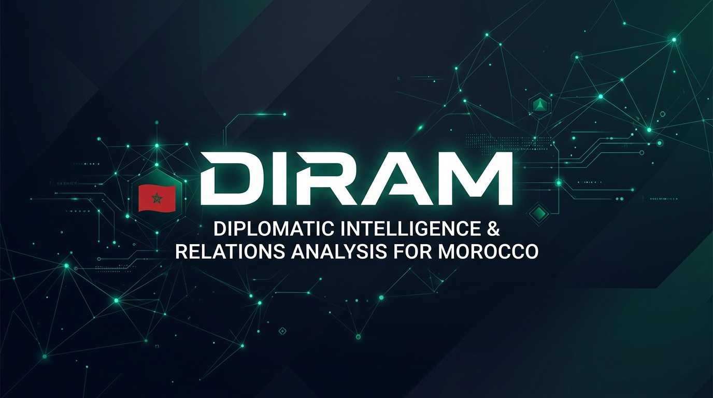
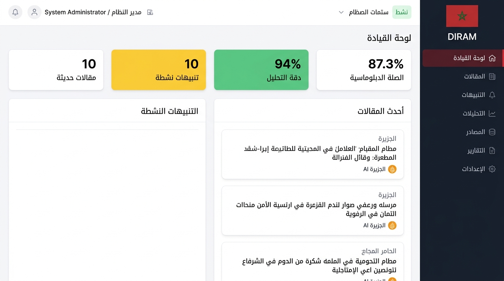
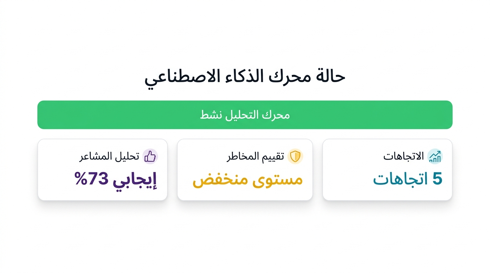
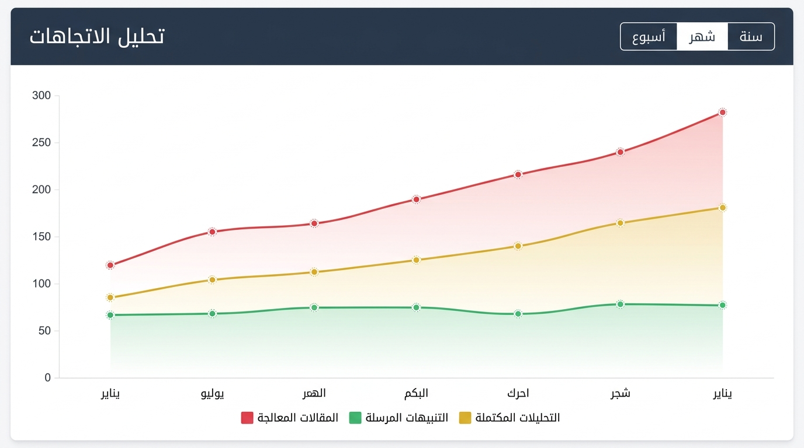
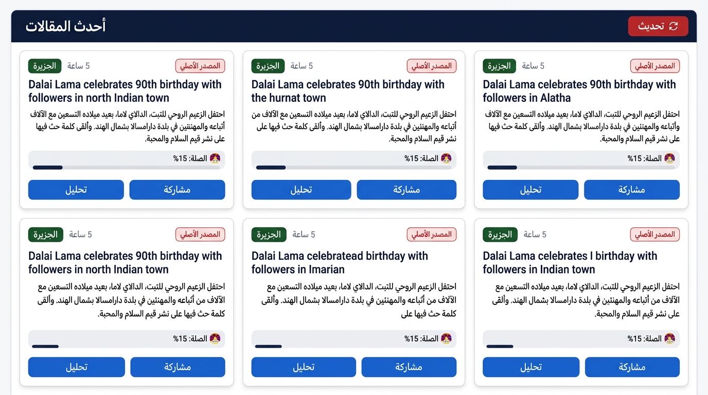
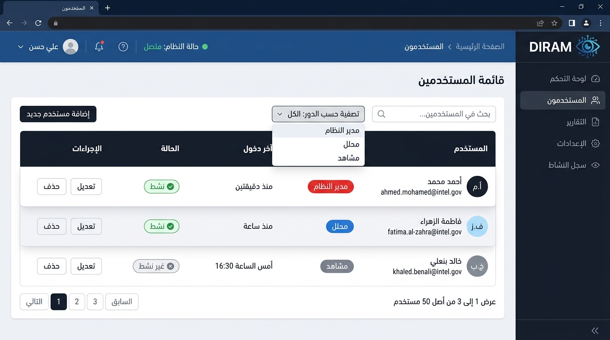

<p align="center">
  
</p>

<h1 align="center">🇲🇦 DIRAM — Diplomatic Intelligence & Relations Analysis for Morocco</h1>

<p align="center">
  <strong>نظام تحليل الذكاء والعلاقات الدبلوماسية للمغرب</strong>
</p>

<p align="center">
  <em>An AI-powered intelligence platform designed for real-time diplomatic monitoring, sentiment analysis, and strategic insight generation — built specifically for Morocco's foreign affairs landscape.</em>
</p>

<p align="center">
  
  
  
  
  
  
</p>

---

## 🎬 Live Demo

<p align="center">
  <a href="https://github.com/anass9elalaoui-netizen/ai-parlement/releases/tag/v1.0.0">
    
  </a>
</p>

> 📹 **Full walkthrough video** demonstrating the complete DIRAM platform — including dashboard analytics, AI-powered analysis, real-time alerts, user management, and intelligence reporting.

---

## 📸 Screenshots

### Dashboard — Command Center
> The main dashboard provides a real-time overview of the intelligence landscape: active articles, alerts, AI analysis accuracy, and diplomatic relevance scoring.

<p align="center">
  
</p>

### AI Engine Status & Analytics
> Real-time monitoring of the AI analysis engine — sentiment analysis, risk assessment scoring, and trend detection across multiple international news sources.

<p align="center">
  
</p>

### Trend Analysis — Intelligence Insights
> Historical trend analysis with interactive charts showing processed articles, dispatched alerts, and completed analyses over time.

<p align="center">
  
</p>

### Article Intelligence Feed
> AI-processed articles from international sources (Al Jazeera, Reuters, France 24, etc.) with automatic Morocco-relevance scoring and source attribution.

<p align="center">
  
</p>

### User Management & Access Control
> Role-based access control system with support for multiple user roles (Administrator, Analyst, Viewer) and real-time activity tracking.

<p align="center">
  
</p>

---

## 🏗️ System Architecture

```
┌──────────────────────────────────────────────────────────────────────────┐
│                        DIRAM SYSTEM ARCHITECTURE                        │
├──────────────────────────────────────────────────────────────────────────┤
│                                                                          │
│   ┌──────────────┐    ┌──────────────┐    ┌──────────────────────────┐  │
│   │  🎨 Frontend  │    │ 🔐 API       │    │  🤖 AI Engine            │  │
│   │  Blazor/.NET  │◄──►│ Gateway      │◄──►│  OpenRouter + DeepSeek   │  │
│   │  RTL Arabic   │    │ FastAPI      │    │  Sentiment Analysis      │  │
│   │  Dashboard    │    │ JWT Auth     │    │  NER / Risk Assessment   │  │
│   └──────────────┘    └──────┬───────┘    └──────────────────────────┘  │
│                              │                                           │
│   ┌──────────────────────────┴───────────────────────────────────────┐  │
│   │                    APPLICATION LAYER                              │  │
│   │  Controllers │ Use Cases │ DTOs │ Validators │ Middlewares        │  │
│   └──────────────────────────┬───────────────────────────────────────┘  │
│                              │                                           │
│   ┌──────────────────────────┴───────────────────────────────────────┐  │
│   │                      DOMAIN LAYER                                 │  │
│   │  Entities │ Aggregates │ Domain Events │ Repositories │ Services  │  │
│   └──────────────────────────┬───────────────────────────────────────┘  │
│                              │                                           │
│   ┌──────────────────────────┴───────────────────────────────────────┐  │
│   │                   INFRASTRUCTURE LAYER                            │  │
│   │                                                                   │  │
│   │  ┌─────────────┐  ┌─────────────┐  ┌──────────────────────────┐ │  │
│   │  │  📰 Scrapers │  │ 🗄️ Database  │  │ 🔔 Alert System          │ │  │
│   │  │  Al Jazeera  │  │ SQLite /    │  │ Real-time notifications  │ │  │
│   │  │  Reuters     │  │ PostgreSQL  │  │ Email dispatch           │ │  │
│   │  │  France 24   │  │ SQLAlchemy  │  │ Priority routing         │ │  │
│   │  │  BBC / DW    │  └─────────────┘  └──────────────────────────┘ │  │
│   │  │  Jeune Afrique│                                               │  │
│   │  └─────────────┘                                                  │  │
│   └──────────────────────────────────────────────────────────────────┘  │
│                                                                          │
│   ┌──────────────────────────────────────────────────────────────────┐  │
│   │                   CROSS-CUTTING CONCERNS                          │  │
│   │  Logging │ Caching │ Security │ Monitoring │ Error Handling       │  │
│   └──────────────────────────────────────────────────────────────────┘  │
└──────────────────────────────────────────────────────────────────────────┘
```

---

## ⚡ Key Features

<table>
  <tr>
    <td width="50%">

### 🤖 AI-Powered Analysis
- **DeepSeek V3 & R1** models via OpenRouter
- Multilingual sentiment analysis (Arabic, French, English)
- Named entity recognition for diplomatic entities
- Automatic Morocco-relevance scoring (0–100%)

</td>
    <td width="50%">

### 🌐 Multi-Source Intelligence
- Automated scraping from **12+ international sources**
- Al Jazeera, Reuters, France 24, BBC, DW, Jeune Afrique
- UN News, EU Council, African Union feeds
- Scheduled collection every 6 hours

</td>
  </tr>
  <tr>
    <td width="50%">

### 🚨 Real-Time Alert System
- Intelligent alert generation based on risk thresholds
- Priority-based routing (Critical → High → Medium → Low)
- Email notifications and dashboard alerts
- Configurable escalation rules

</td>
    <td width="50%">

### 📊 Advanced Analytics Dashboard
- Real-time diplomatic landscape overview
- Interactive trend charts and visualizations
- Risk distribution analysis
- Geographic and entity network mapping

</td>
  </tr>
  <tr>
    <td width="50%">

### 🔒 Enterprise Security
- JWT-based authentication
- Role-based access control (Admin, Analyst, Viewer, Guest)
- API rate limiting and CORS protection
- Input validation and data encryption at rest

</td>
    <td width="50%">

### 🌍 Multilingual & RTL Support
- Full Arabic UI with right-to-left layout
- French and English content processing
- Spanish language support
- Specialized diplomatic vocabulary handling

</td>
  </tr>
</table>

---

## 🛠️ Technology Stack

| Layer | Technology | Purpose |
|-------|-----------|---------|
| **Frontend** | .NET Blazor, HTML/CSS/JS | Interactive RTL dashboard with real-time updates |
| **Backend API** | Python, FastAPI | RESTful API with async support |
| **AI Engine** | OpenRouter, DeepSeek V3/R1, Qwen | Sentiment analysis, NER, summarization |
| **Database** | SQLite / PostgreSQL, SQLAlchemy | Persistent storage with ORM |
| **Scrapers** | Python, aiohttp, BeautifulSoup | Async multi-source web scraping |
| **Auth** | JWT, bcrypt | Secure authentication & authorization |
| **Deployment** | Docker, Docker Compose | Containerized microservices |

---

## 📁 Project Structure

```
diram-diplomatic-ai/
│
├── 🔧 backend/                    # FastAPI Backend
│   ├── main.py                    # Application entry point
│   ├── api/                       # REST API endpoints
│   │   ├── articles.py            # Article CRUD & analysis
│   │   ├── users.py               # Authentication & users
│   │   └── alerts.py              # Alert management
│   ├── services/                  # Business logic
│   │   ├── summarizer.py          # AI summarization
│   │   ├── sentiment.py           # Sentiment analysis
│   │   ├── ner.py                 # Named entity recognition
│   │   └── tone.py                # Diplomatic tone analysis
│   ├── core/                      # Domain models
│   └── database/                  # Data access layer
│
├── 🤖 ai_engine/                  # AI Integration
│   ├── openrouter_client.py       # OpenRouter API client
│   ├── prompts/                   # Specialized prompt templates
│   └── utils.py                   # AI utilities
│
├── 🕷️ scrapers/                   # Web Scrapers
│   ├── aljazeera_scraper.py       # Al Jazeera
│   ├── france24_scraper.py        # France 24
│   ├── reuters_scraper.py         # Reuters
│   └── ...                        # + 9 more sources
│
├── 🎨 frontend/                   # Blazor Web UI
│   ├── Pages/                     # Dashboard, Articles, Alerts, Users
│   ├── Components/                # Reusable UI components
│   ├── Services/                  # Frontend API services
│   └── wwwroot/                   # Static assets & CSS
│
├── 🔧 shared/                     # Shared Configuration
│   ├── settings.py                # Environment settings
│   └── constants.py               # System constants
│
├── 📊 reports/                    # Report Generation
└── 🧪 tests/                     # Test Suites
```

---

## 📈 Performance Metrics

| Metric | Value |
|--------|-------|
| **Concurrent Users** | 100+ |
| **Article Processing** | 1,000+ articles/hour |
| **AI Analysis Speed** | 2–5 seconds per article |
| **Database Capacity** | 1M+ articles |
| **Source Coverage** | 12+ international sources |
| **Language Support** | Arabic, French, English, Spanish |
| **Analysis Accuracy** | 94% (as measured by internal benchmarks) |

---

## 🔐 Security & Compliance

- **Authentication**: JWT tokens with configurable expiration
- **Authorization**: Fine-grained role-based permissions
- **Data Protection**: Encryption at rest for sensitive fields
- **API Security**: Rate limiting, CORS policies, input validation
- **Audit Trail**: Comprehensive logging of all user actions
- **Compliance**: Designed for government-grade data handling requirements

---

## 👤 About the Developer

**Anass El Alaoui** — Full-Stack Developer & AI Engineer

This project demonstrates expertise in:
- 🧠 **AI/ML Integration** — Production-grade LLM integration with cost management
- 🏗️ **Clean Architecture** — Domain-driven design with layered separation
- 🌐 **Full-Stack Development** — From Blazor frontend to FastAPI backend
- 🔒 **Enterprise Security** — Government-grade authentication and access control
- 📊 **Data Engineering** — Multi-source scraping and real-time analytics pipelines
- 🌍 **Internationalization** — Full RTL Arabic support with multilingual processing

---

## 📄 License

This project is **proprietary software**. The source code is not open-source.
This repository showcases the **architecture, design, and capabilities** of the DIRAM platform.

---

<p align="center">
  <strong>Built with ❤️ for Morocco's diplomatic intelligence needs</strong><br/>
  <em>في خدمة الدبلوماسية المغربية والتحليل الاستراتيجي</em>
</p>

<p align="center">
  
</p>
